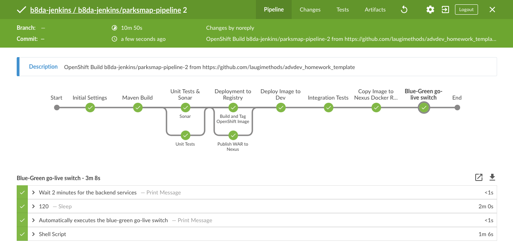

# Parks Map Multi-service Application

This is an example application consisting of three micro-services to be used in the Advanced OpenShift Development Homework Assignment as defined in https://www.opentlc.com/labs/ocp_advanced_development/07_1_Assignment_Lab.html .

> The original repository has been clone into this public repository, which the instructor has access to: https://github.com/laugimethods/advdev_homework_template

In this repository are three services:

* Two backend services providing geospatial data about Nationalparks and Major League Baseball park. The backend services are exposed as services with label "type=parksmap-backend". The data can be stored in a MongoDB database.
* A frontend parksmap application that can display the data on a map on a web site. The parksmap application dynamically discovers services with label "type=parksmap-backend".

There is also a directory "Infrastructure" which contains required scripts to set up the entire homework environment from scratch as well as templates to create the various components.

Here is a link to a successful run on the the pipeline defined at https://github.com/wkulhanek/advdev_homework_grading: https://jenkins-gpte-jenkins.apps.na39.openshift.opentlc.com/blue/organizations/jenkins/Grade%20Adv%20Development%20Homework/detail/Grade%20Adv%20Development%20Homework/912/pipeline/


## Some notes:

* For debugging purpose, it is possible to call the scripts, step by step, directly from a console (credential files have to be defined first):
```
./full_setup.sh setup_projects
```
If needed, individual scripts can be called:
```
./full_setup.sh setup_projects STOP
sleep 5
./full_setup.sh setup_prod STOP
```
Also, it is possible to manually trigger the blue/green switch:
```
./set_prod.sh  "$GUID"
./reset_prod.sh  "$GUID"
```

Take note that to make sure that the relative paths included inside those scripts are not the ones by default (i.e. the ones required inside the main pipeline), some variables have to be set locally:
```
export TEMPLATES_PATH='../templates'
export BIN_PATH='.'
export FAST_MODE=true
```

* Since the BuildConfig files cannot make use of parameters, they need to be "hard coded" first with the right values before being deployed:
```
sed "s/\${GUID}/${GUID}/g;s/\${CLUSTER}/${CLUSTER}/g;s/\${FAST_MODE}/${FAST_MODE:-false}/g" "${TEMPLATES_PATH:-./Infrastructure/templates}"/BuildConfig_MLBParks | oc create -n "${GUID}-jenkins" -f -
```

* All the Jenkins builds are defined as [declarative pipelines](MLBParks/Jenkinsfile), while still running on a `skopeo` pods:
```
pipeline {
  agent {
    kubernetes {
      cloud "openshift"
      label 'skopeo-pod'
      inheritFrom "maven"
      containerTemplate {
        name 'jnlp'
        image "docker-registry.default.svc:5000/${GUID}-jenkins/jenkins-slave-appdev"
        resourceRequestMemory '1Gi'
        resourceLimitMemory '2Gi'
      }
    }
  }
  stages {
    stage('Maven Build') {
      steps {
        container('jnlp') {
          dir('MLBParks') {
            sh "$maven clean install -DskipTests=true"
          }
        }
      }
...
```



* The `jenkins-slave-appdev` Docker Image is itself build thanks to a [dedicated build configuration](./Infrastructure/templates/BuildConfig_Skopeo).
